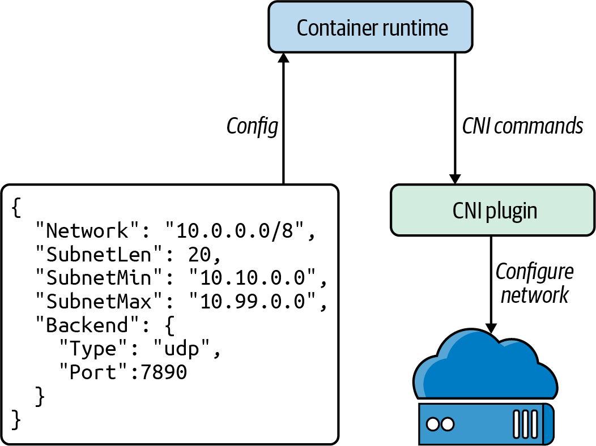

## kubelet

## The CNI Specification

Four operations that a CNI plugin must support:
- ADD: Add a container to the network.
- DEL: Delete a container from the network.
- CHECK: Return an error if there is a problem with the container’s network.
- VERSION: Report version information about the plugin.

## Popular CNI plugins

| Name        | NetworkPolicy   | Data storage                | Network setup                  |
|:------------|:----------------|:----------------------------|:-------------------------------|
| Cilium      | Yes             | etcd or consul              | Ipvlan(beta), veth, L7 aware   |
| Flannel     | No              | etcd                        | Layer 3 IPv4 overlay network   |
| Calico      | Yes             | etcd or Kubernetes API      | Layer 3 network using BGP      |
| Weave Net   | Yes             | No external cluster store   | Mesh overlay network           |

