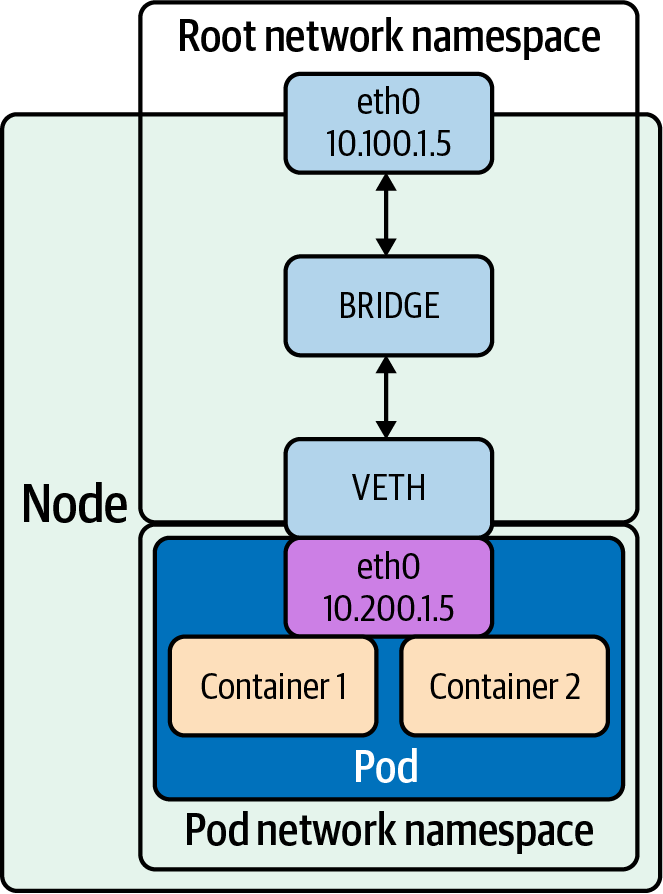
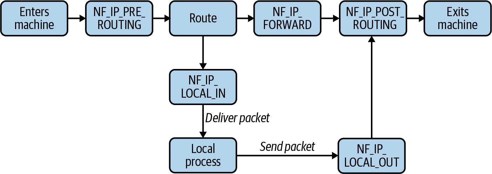
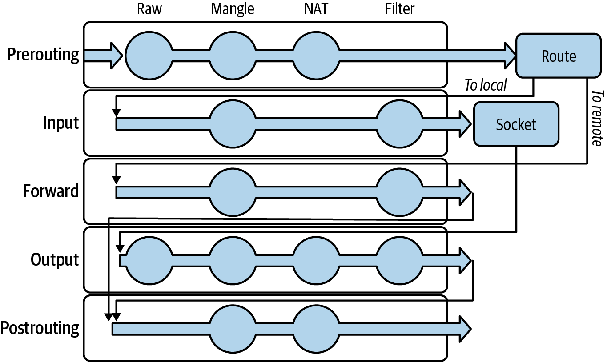
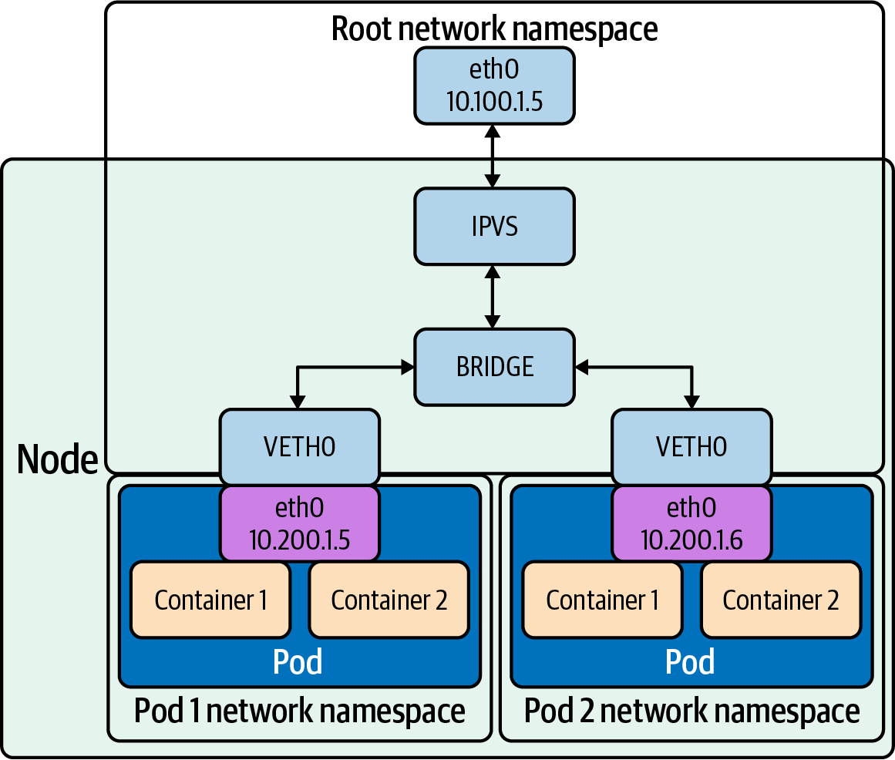

## Bridge

The bridge interface allows system administrators to create multiple layer 2 networks on a single host.Bridges allow pods, with their individual network interfaces, to interact with the broader network via the node’s network interface.



create a bridge device named br0 and attach a virtual Ethernet (veth) device, veth, and a physical device, eth0, using ip

```shell
# Add a new bridge interface named br0.
ip link add br0 type bridge
# Attach eth0 to our bridge.
ip link set eth0 master br0
# Attach veth to our bridge.
ip link set veth master br0
```

brctl命令也可以管理Bridges

```shell
[root@ci-7611025-rdo-qzhao ~]# brctl
Usage: brctl [commands]
commands:
	addbr     	<bridge>		add bridge
	delbr     	<bridge>		delete bridge
	addif     	<bridge> <device>	add interface to bridge
	delif     	<bridge> <device>	delete interface from bridge
	hairpin   	<bridge> <port> {on|off}	turn hairpin on/off
	setageing 	<bridge> <time>		set ageing time
	setbridgeprio	<bridge> <prio>		set bridge priority
	setfd     	<bridge> <time>		set bridge forward delay
	sethello  	<bridge> <time>		set hello time
	setmaxage 	<bridge> <time>		set max message age
	setpathcost	<bridge> <port> <cost>	set path cost
	setportprio	<bridge> <port> <prio>	set port priority
	show      	[ <bridge> ]		show a list of bridges
	showmacs  	<bridge>		show a list of mac addrs
	showstp   	<bridge>		show bridge stp info
	stp       	<bridge> {on|off}	turn stp on/off
```


Veth 设备是成对创建

namespace net1和net2中的veth1和veth2能互相通信。
```shell
ip netns add net1
ip netns add net2
ip link add veth1 netns net1 type veth peer name veth2 netns net2
```


## Linux内核中的包处理

### Netfilter

Netfilter 有5个hook，会在数据包通过内核的特定阶段触发每个hook.

程序注册hook，内核在特定阶段调用，实现在用户空间定义内核操作数据包的能力。

iptables中把chains的概念映射到Netfilter的hooks。



### Conntrack

Conntrack是Netfilter的一个组件，用于跟踪连接到（和来自）机器的连接。

Conntrack 通过由源地址、源端口、目的地址、目的端口和 L4 协议组成的元组来识别连接。
```shell
# 当前所有flow
conntrack -L
```

### Routing

```shell
# 显示本机路由表
route -n
```

一些 CNI 插件会大量使用路由表。

## High-Level Routing

### iptables

最常用的tables：
- Filter: firewall相关的rules，数据包的接受和拒绝
- NAT: NAT相关的rules,修改源或目的ip地址。
- Mangle: 非NAT相关的rules，可以编辑数据包头。
- Raw: 禁用某些数据包的连接跟踪

不同类型的table包含的chain类型也不同，因此在packet处理流程
的不同阶段发挥作用。

chains包含一系列rules。
有五个内置的顶级链，每个链都对应一个 Netfilter 钩子。
PREROUTING,INPUT,FORWARD,OUTPUT,POSTROUTING

```shell
# 查看过滤表的规则链、规则以及数据包/字节计数器
iptables -vnL

# 查看与table相关的chain
iptables -L -t filter
```



iptables可以使用DNAT rules和随机选择做负载均衡。
```shell
$ iptables -t nat -A OUTPUT -p tcp --dport 80 -d $FRONT_IP -m statistic --mode random --probability 0.5 -j DNAT --to-destination $BACKEND1_IP:80
$ iptables -t nat -A OUTPUT -p tcp --dport 80 -d $FRONT_IP -j DNAT --to-destination $BACKEND2_IP:80
```

iptables在有大量rules存在时会变慢，且负载均衡功能有限。

### IPVS

IP Virtual Server是Linux L4层的负载均衡。



```shell
# 创建一个lb，后端两个server
ipvsadm -A -t 1.1.1.1:80 -s lc
ipvsadm -a -t 1.1.1.1:80 -r 2.2.2.2 -m -w 100
ipvsadm -a -t 1.1.1.1:80 -r 3.3.3.3 -m -w 100

# 查看
ipvsadm -L
```

### eBPF

[eBPF官方文档](https://ebpf.io/what-is-ebpf/#what-is-ebpf)


## Network Troubleshooting Tools

|Case |Tools|
|---|---|
| Checking connectivity  |   traceroute,ping,telnet,netcat|
|   Port scanning| nmap  |
|Checking DNS records | dig, commands mentioned in “Checking Connectivity”|
|Checking HTTP/1 | cURL, telnet, netcat|
|Checking HTTPS| OpenSSL, cURL|
|Checking listening programs|netstat|

### ping

ping使用的ICMP是4层协议，Kubernetes支持TCP和UDP，不支持ICMP。因此ping一个Kubernetes service会失败。

```shell
# 向网络主机发送 ICMP 回显请求数据包。

# Ping 指定的主机：
ping 主机

# 对主机执行指定定次数的 ping 操作：
ping -c 次数 主机

# Ping 主机,指定请求之间的间隔（以秒为单位）（默认为 1 秒）：
ping -i 秒 主机

# Ping 主机, 但不尝试查找地址的符号名：
ping -n 主机

# Ping 主机 并在收到数据包时响铃（如果您的终端支持）：
ping -a 主机

# Ping 主机 并打印接收数据包的时间（此选项是 Apple 的附加项）：
ping --apple-time 主机
```

### traceroute

traceroute 显示从一台主机到另一台主机的网络路由

If traceroute receives no response from a given hop before timing out, it prints a *. Some hosts may refuse to send a TIME_EXCEEDED packet, or a firewall along the way may prevent successful delivery.

```shell
# Traceroute to a host:
traceroute example.com
traceroute k8s.io

# Disable IP address and host name mapping:
traceroute -n example.com

# Specify wait time in seconds for response:
traceroute --wait=0.5 example.com

# Specify number of queries per hop:
traceroute --queries=5 example.com

# Specify size in bytes of probing packet:
traceroute example.com 42

# Determine the MTU to the destination:
traceroute --mtu example.com

# Use ICMP instead of UDP for tracerouting:
traceroute --icmp example.com
```


### dig

DNS查询工具


```shell
# dig [options] <domain>
dig kubernetes.io

# 展示某种类型DNS记录
dig -t A kubernetes.io
dig -t TXT kubernetes.io

# Lookup the IP(s) associated with a hostname (A records):
dig +short example.com

# Get a detailed answer for a given domain (A records):
dig +noall +answer example.com

# Query a specific DNS record type associated with a given domain name:
dig +short example.com A|MX|TXT|CNAME|NS

# Get all types of records for a given domain name:
dig example.com ANY

# Specify an alternate DNS server to query:
dig @8.8.8.8 example.com

# Perform a reverse DNS lookup on an IP address (PTR record):
dig -x 8.8.8.8

# Find authoritative name servers for the zone and display SOA records:
dig +nssearch example.com

# Perform iterative queries and display the entire trace path to resolve a domain name:
dig +trace example.com
```

### telnet

```shell
telnet <address> <port>
```

#### nmap

网络探索工具和安全/端口扫描程序

由于 nmap 可以快速显示远程机器可以访问哪些服务，因此它可以快速、轻松地发现不应暴露的服务。

```shell
nmap -h

# 检查 IP 地址是否可用，并猜测远程主机的操作系统：
nmap -O IP或者主机名

# 尝试确定指定的主机是否启动以及它们的名称是什么：
nmap -sn IP或者主机名 可选的其它地址
```

### netstat

netstat 可以显示机器网络堆栈和连接的各种信息

```shell
# 检查哪个进程正在监听某个端口
netstap -lp | grep port

# 列出所有端口
netstat -a

# 列出所有被侦听端口：
netstat -l

# 列出侦听的 TCP 端口：
netstat -t

# 显示监听给定协议的PID和程序名：
netstat -p 协议

# 打印路由表：
netstat -nr
```

### netcat(nc)

netcat 是一种多用途工具，用于建立连接、发送数据或监听套接字。它可以"手动"运行服务器或客户端，以便更详细地检查发生的情况。

```shell
# Start a listener on the specified TCP port and send a file into it:
nc -l -p port < filename

# Connect to a target listener on the specified port and receive a file from it:
nc host port > received_filename

# Scan the open TCP ports of a specified host:
nc -v -z -w timeout_in_seconds host start_port-end_port

# Start a listener on the specified TCP port and provide your local shell access to the connected party (this is dangerous and can be abused):
nc -l -p port -e shell_executable

# Connect to a target listener and provide your local shell access to the remote party (this is dangerous and can be abused):
nc host port -e shell_executable

# Act as a proxy and forward data from a local TCP port to the given remote host:
nc -l -p local_port | nc host remote_port

# Send an HTTP GET request:
echo -e "GET / HTTP/1.1\nHost: host\n\n" | nc host 80
```

### Openssl

openssl可以创建密钥和证书、签署证书，测试 TLS/SSL 连接

```shell
openssl [sub-command] [arguments] [options]

openssl s_client -connect k8s.io:443
```

### cURL

```shell
# 将指定 URL 的内容下载到文件：
curl http://example.com --output 文件名

# 将文件从 URL 保存到由 URL 指示的文件名中：
curl --remote-name http://example.com/filename

# 下载文件，跟随重定向，并且自动续传（恢复）前序文件传输：
curl --remote-name --location --continue-at - http://example.com/filename

# 发送表单编码数据（application/x-www-form-urlencoded 的 POST 请求）：
curl --data 'name=bob' http://example.com/form

# 发送带有额外请求头，使用自定义请求方法的请求：
curl --header 'X-My-Header: 123' --request PUT http://example.com

# 发送 JSON 格式的数据，并附加正确的 Content-Type 请求头：
curl --data '{"name":"bob"}' --header 'Content-Type: application/json' http://example.com/users/1234

# 使用用户名和密码，授权访问服务器：
curl --user myusername:mypassword http://example.com

# 为指定资源使用客户端证书和密钥，并且跳过证书验证：
curl --cert client.pem --key key.pem --insecure https://example.com
```